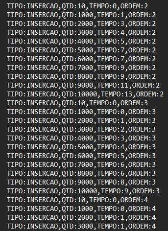

## AED2-EP1 - Busca e Inserção em Árvore B

#### O uso de árvores B tem o intuito de maximizar a eficiência do processo de leitura/escrita baseado na forma de operação dos discos rígidos (HDs), ou seja, aproveitar a posição da cabeça de leitura/escrita e  ler/gravar, em blocos, uma sequência de bits.

 

Exemplo de Árvore B:

 

---
### Estrutura das Classes

- **Main**
    - Classe que ~~(meio obviamente)~~ contém o método `main`, ou seja, o que é chamado ao se iniciar o programa e com isso roda uma série de simulações para diferentes valores de `t` (tamanho da árvore), fazendo uso da classe `Simulacao`, conforme descrito abaixo. 

    - O código atual contempla a simulação de árvores com as seguintes ordens: 2, 3, 4, 5, 6, 7, 8, 9, 10, 20, 30, 40, 50, 100, 200, 300, 400, 500, 600, 700, 800, 900, 1.000, 2.000, 3.000, 4.000, 5.000, 6.000, 7.000, 8.000, 9.000 e 10.000.

     

- **Simulação**
    -  Responsável por executar os "blocos" de simulações, ou seja, rodar os métodos de **insercao**, **busca** e **remocao** *(implementados na classe `ArvoreB`, conforme descrito abaixo)*, permitindo compor diferentes cenários:

        - **Inserções:** foram testadas as seguinte quantidades de inserções: 10, 1.000, 2.000, 3.000, 4.000, 5.000, 6.000, 7.000, 8.000, 9.000 e 10.000.

        - **Busca:** independente do tamanho da árvore, foram feitas apenas 1.000 buscas em cada simulação, considerando em 2 tipos:
            - *Existente:* foram procurados valores distintos  que certamente estariam na árvore
            - *Inexistente:* foram procurados valores que muito provavelmente não estariam na árvore

        - **Remoções:** foram removidos valores de `0` até `tamanhoArvore-1` em cada rodada da simulação, mas como os números das chaves são gerados de forma aleatória, não há garantia que dê fato ocorra a exclusão. De qualquer forma, quando ocorre, todo o tratamento necessário para manter a árvore B consistente é feito, como os "merge" e "split".

    - Nesse processo também são armazenados os tempos de início e fim da execução de cada etapa do algoritmo *(através do objeto instanciado pela classe `MedidorTempo`, conforme descrito abaixo)*, sendo salvos separadamente, `log_insercao.txt`, `log_busca.txt` e `log_remocao.txt`, para posterior análise. 

        Exemplo do arquivo de `log_insercao.txt`:

        

     

- **ArvoreB**
    - Classe responsável por armazenar a estrutura da Árvore B, como por exemplo a **ordem**, o tamanho do **nó interno** e do **nó folha**, o número máximo de **chaves** e **filhos**, uma referência para o **No** raiz, etc. 

    - Essa classe implementa de fato os métodos de **inserção**, **busca** e **remoção**, além dos demais métodos que auxiliam nesse processo, como a **troca de raiz**, o **split** e o **merge**, por exemplo.
    

     

- **No**
    - Com essa classe é possível instanciar objetos que representam um único nó na árvore B e armazenar o estado completo dele, sendo principalmente, o **número de chaves**, a **folha**, o **endereco** do No, além de um vetor para armazenar as chaves e um vetor para armazenar os filhos.

    - Aqui também são implementados os métodos para `importarChave`, `importarFilhos` e as "transferências" de chaves da direita -> esqueda e vice-versa.
    
     

- **MedidorTempo**
    - Responsável por armazenar e calcular o tempo total gasto entre dois momentos distintos, considerando todas as operações de CPU, Entrada/Saída, entre outras chamadas de sistema. Como a porção de tempo de E/S é relativamente superior (e é isso que pretende-se analisar nesse EP), o tempo gasto com as demais operações será diluído/irrelevante entre as simulações.

     

- **DebugArvore**
    - Usada apenas para fins de debug, pois ela imprime na tela o estado atual da árvore.

     
---
### Compilação e Execução
Para compilar o código, basta executar o comando: `javac Main.java`

Para execucar o programa, basta executar o comando: `java Main`

 

---
### Resultados

#### Resumidamente, foi possível observar que nos HDs, quanto **maior a ordem** da árvore, **menor é o tempo gasto** para inserções, da maior para a menor ordem, elas tiverem uma **redução** de tempo de aproximadamente **85%.** Por fim, pode-se concluir que **ordens de árvores maiores trazem sempre um desempenho melhor**, independente do hardware utilizado.

 

---
### Créditos

Professor: Alexandre Freire

Aluno: José Rafael R. Nascimento

Aluno: Luiz Fernando Conceição dos Santos

